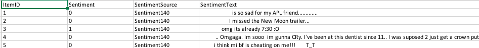
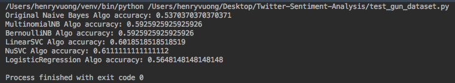
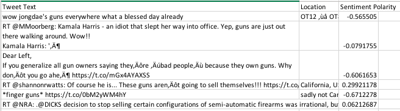
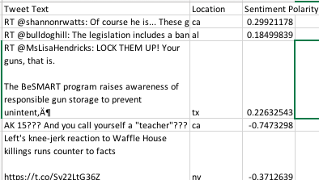
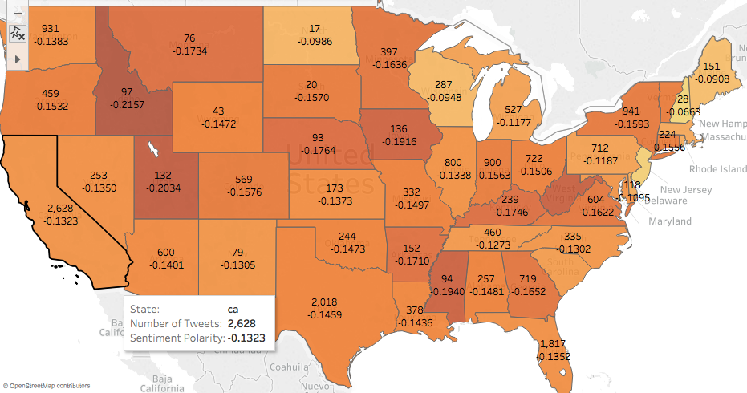
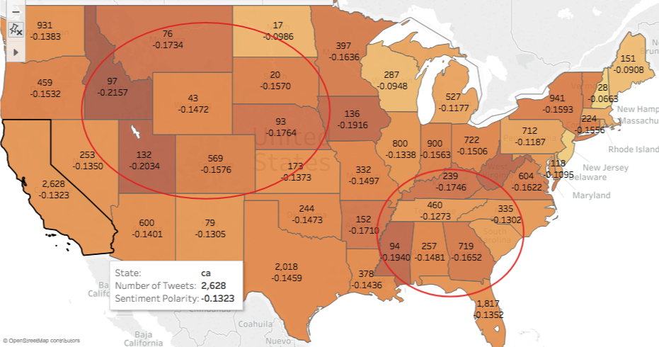
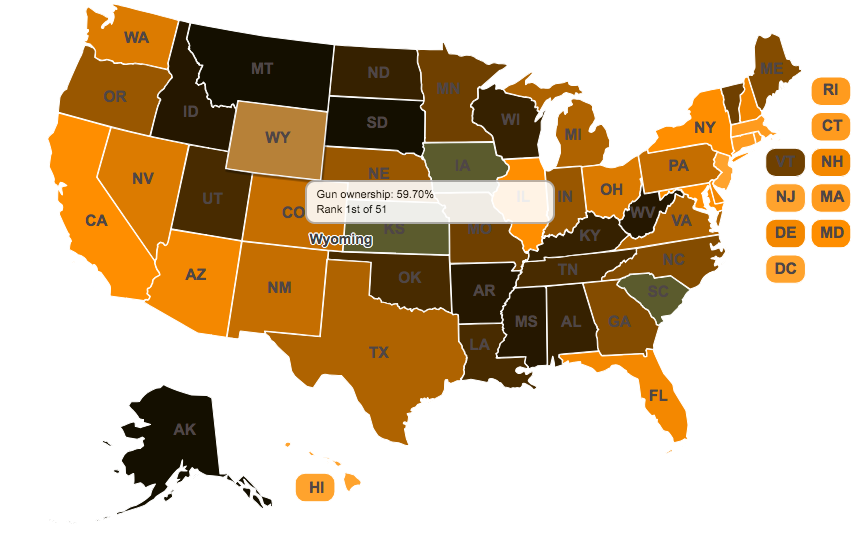

# Twitter Sentiment Analysis

Repository with all the files/scripts I used for Twitter sentiment analysis on gun related tweets. Project was for the MISA 2018 Coding Challenge (Case Competition)

Synopsis:
Goal was to investigate interesting causes of gun violence in America. I decided to analyze the sentiment towards guns across U.S. states. To gather data, I turned to the Twitter platform as it is a decent representation of sentiment. Used Scikit-learn and NLTK to process Twitter tweets retrieved using Twitter's API (Tweepy). Was able to identify a slight correlation between gun ownership rate per person and sentiment towards guns.

Technologies used: Python, machine learning, natural language processing, Tableau, Git

## Walkthrough

1) Generate the classifiers based on the Twitter dataset (generate_classifiers.py).

    1. Downloaded Ibrahim Naji's Twitter Sentiment Analysis Training Corpus to train with (Only used 10,000 tweets).
    2. Read in the Twitter dataset
    3. Used NLTK's word_tokenize function to tokenize the words in the tweet.
    4. Get the features set of the Twitter dataset (top 3000 words that appear) and parse each tweet leaving only words that appear in the feature set.
    5. Train the classifiers using the feature set. Ran NLTK's Naive Bayes algorithm and Scikit-learn's Multinomial NB, Bernoulli NB, Linear SVC, Nu SVC, and Logistic Regression.
    6. Pickle dataset used and classiers. (Pi)
    
    *Screenshot of the Twitter dataset used to train classifiers*
    

2) Test the classifier with the gun dataset (test_gun_dataset.py).

    1. Read in the Twitter gun related dataset which we will test the classifiers on (retrieved using DiscoverText and Sifter).
    2. Create a feature set and then a testing set (same as what we did previously in step 1).
    3. Run the NLTK.classify.accuracy function.
    
    *Screenshot of the classifiers accuracy*
    
    
    Notes:
    - The Twitter gun related dataset was historical data retrieved in February (we retrieved historical data at first because Tweepy for was not letting us stream tweets. However, I will address this in my conclusion)
    - Accuracy was averaging about 60 percent if we remove the LogisticRegression and NLTK's NB.
    - I tested the classifiers on the dataset I trained them in, and it produced around a 77 percent accuracy. So a noticeable drop.
    - To investigate bias, I tested the training set on exclusively positive and then negative tweets. The result was a noticeable negative bias towards tweets.
    
3) Stream Twitter data and record the sentiment value using the sentiment_analysis_module.py (twitter_stream.py).

    1. Set up a Twitter app and set our access token using Oath to connect to the Twitter API
    2. Stream tweets related the 'guns' and write them into a csv file.
    3. Write in location, text, and sentiment polarity. Sentiment polarity is the net of the probability of positive and negative sentiment. (ex. A sentiment polarity of '1' would mean the tweet is 100 percent chance of being positive and 0 percent change of being negative)
    4. Collect in about 22,000 tweets
    
    *Screenshot of the Twitter tweets collected*
    
    
    
     Notes:
     - Some of the tweets do not have a location. This will be addressed in the next step.
    
4) Parse the Twitter stream data for only tweets with location (parse_twitter_stream.py)

    1. Parse the Twitter stream data for tweets with locations. The sentiment analysis is to group tweet sentiment by state.
    2. Search for key words such as "Texas" or "TX" and write the filtered Twitter stream data into another csv.
    
    *Screenshot of the parsed Twitter tweets collected*                       
    
    
5) Sort the parsed Twitter data by state (sort_twitter_stream_data.py)

    1. Group the data by state and calculate average sentiment polarity.
    2. Visualize result on Tableau.

    *Visualization of the result (via Tableau)*
    

6) Analysis

    If you look at the midwest and southeast United States, you can see there is a slightly more negative sentiment compared to the other states.
    
    
    And if we look at the gun ownership rate per person, there is some correlation.
    
    

    So the more negative sentiment a person is towards guns, the higher the gun ownership rate. It is an almost opposite type of result I was expecting.
    
7) Conclusion

    Overall, I learned a lot during this project. I strengthened my Python scripting and exposed myself to powerful libraries like NLTK and Scikit-learn. In addition, I utilized Twitter's API in a unique way to investigate a controversial problem in the United States.
    
    Some things in the future to improve this data analysis project:
    - [ ] Train with data is more gun related. Couldn't do this as I did not have the time to label 10,000+ Twitter tweets.
    - [ ] Addressing a note I made in step 2, used Twitter stream data to test accuracy.
    - [ ] Explore different machine learning algorithms.
    - [ ] Train with a larger dataset. Training with 10,000 Tweets already gave my Mac Air a hard time, so I would like a more computationally powerful computer.
    - [ ] I only used the BNB and MNB classifiers to classify tweets as I could not figure out how to extract probability from the Linear SVC and Nu SVC classifiers.
    - [ ] Twitter data is dirty. Perhaps a different approach?
    
    Again, this was my first data analysis project, and I am still learning. If you have any suggestions or possible errors I made, I urge you to message me, so I can investigate further.

## Libraries / Datasets Used

**Libraries**
- [x] Natural Language Toolkit (NLTK)
- [x] Twitter API (Tweepy)
- [x] Machine Learning (scikit-learn)
<<<<<<< HEAD
- [x] CSV
*Datasets*
- [x] Twitter Sentiment Analysis Training Corpus by Ibrahim Naji (http://thinknook.com/twitter-sentiment-analysis-training-corpus-dataset-2012-09-22/)
- [x] Gun Ownership Statistics (http://demographicdata.org/facts-and-figures/gun-ownership-statistics/ )

**Datasets**
- [x] Twitter Sentiment Analysis Training Corpus by Ibrahim Naji (http://thinknook.com/twitter-sentiment-analysis-training-corpus-dataset-2012-09-22/)
- [x] Twitter Gun related Datset from historical Twitter data (DiscoveryText/Sifter)

## Notes
- The Twitter dataset by Ibrahim Naji that I used is removed as it is too big to upload to GitHub. However, there is a pickled dataset with the tweets I used.
- Cleaned up code and file directories. Unsure if program will function how it intends to.

## License

Copyright [2018] [Henry Vuong]

Unless required by applicable law or agreed to in writing, software
distributed under the License is distributed on an "AS IS" BASIS,
WITHOUT WARRANTIES OR CONDITIONS OF ANY KIND, either express or implied.
See the License for the specific language governing permissions and
limitations under the License.

